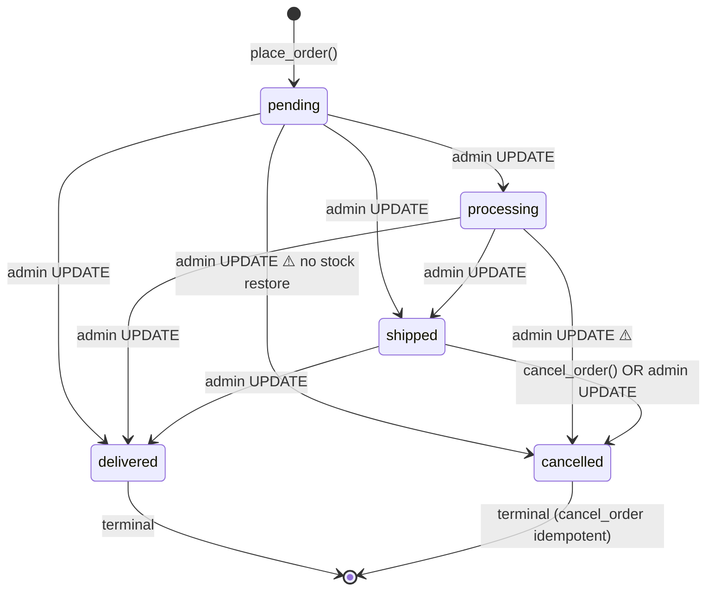
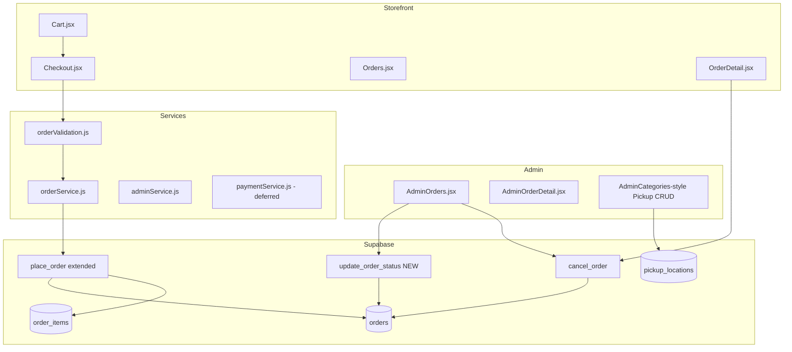

# Phase 2 — Workstream 3: Checkout & Order Management — Audit & Design

**Status:** Audit + design only — no implementation  
**Date:** 2026-07-12  
**Prerequisites:** Phase 2 Workstream 1 (Inventory) and Workstream 2 (Product Management) complete; migrations `001`–`012` applied and validated  
**Reference designs:** `docs/audits/Phase2_Workstream1_Inventory_Design.md`, `docs/audits/Phase2_Workstream2_ProductManagement_Design.md`

---

## 1. Executive Summary

Babees Place has a **minimal but architecturally sound checkout core**: orders are created exclusively via the atomic `place_order()` RPC with row locking, server-side pricing, stock deduction, and inactive-product rejection. Inventory hardening (WS1) added `cancel_order()` for atomic cancellation with stock restoration. However, the **order management layer is incomplete**: checkout has no delivery/pickup/payment steps, admin status updates bypass `cancel_order()` (breaking inventory integrity on cancel), customer cancellation is unavailable, and fulfillment fields exist only as deferred schema notes and unrendered `mapOrder` fields.

This document audits database, services, customer UX, admin UX, validation, and tests, then proposes a phased implementation plan for a **production-ready checkout and order management system** without modifying code in this workstream.

**Highest-risk gap:** Admin sets `status = 'cancelled'` via direct `UPDATE orders`, which **does not restore stock**. The `cancel_order()` RPC exists and is exported in `orderService`, but **no UI calls it**.

---

## 2. Step 1 — Database Audit

### 2.1 Current Schema (post-012, live)

#### `orders`

| Column | Type | Null | Default | Notes |
|---|---|---|---|---|
| `id` | uuid | NO | `gen_random_uuid()` | PK |
| `user_id` | uuid | NO | — | FK → `auth.users(id)` ON DELETE CASCADE **NOT VALID** |
| `total` | numeric | YES | — | Server-computed in `place_order()` |
| `status` | text | NO | `'pending'` | CHECK (see §2.3) — **NOT VALID** |
| `payment_status` | text | NO | `'pending'` | CHECK validated |
| `note` | text | YES | — | Admin note (002) |
| `created_at` | timestamp | YES | `now()` | Legacy `timestamp` (not `timestamptz`) |
| `updated_at` | timestamptz | NO | `now()` | Trigger-maintained |

**Deferred (documented in 002, not in migration chain):**

- `delivery_type`, `pickup_location`, `delivery_address`, `delivery_fee`, `mpesa_receipt_number`

#### `order_items`

| Column | Type | Null | Default | Notes |
|---|---|---|---|---|
| `id` | uuid | NO | `gen_random_uuid()` | PK |
| `order_id` | uuid | NO | — | FK → `orders(id)` ON DELETE CASCADE |
| `product_id` | uuid | YES | — | FK → `products(id)` ON DELETE SET NULL **NOT VALID** |
| `quantity` | smallint | NO | — | CHECK `quantity > 0` (validated) |
| `price` | numeric | YES | — | Snapshot at checkout |
| `name` | text | NO | `''` | Snapshot at checkout |
| `image_url` | text | YES | — | Snapshot at checkout |
| `created_at` | timestamptz | NO | `now()` | Added 002 |

#### `profiles` (order-relevant)

| Column | Notes |
|---|---|
| `id` | PK; matches `auth.users.id` |
| `full_name`, `email`, `phone` | Embedded in order queries |
| `role` | `customer` \| `admin`; drives `is_admin()` |

**No FK** from `orders.user_id` → `profiles.id` (only → `auth.users`). PostgREST embed `profiles (...)` works via shared `id` but is not enforced at DB layer.

### 2.2 Constraints & Indexes

| Object | Table | Status |
|---|---|---|
| `orders_pkey` | orders | PK |
| `orders_user_id_fkey` | orders | FK → auth.users CASCADE **NOT VALID** |
| `orders_status_check` | orders | CHECK vocabulary — **NOT VALID** |
| `orders_payment_status_check` | orders | CHECK — **validated** |
| `order_items_order_id_fkey` | order_items | FK CASCADE — validated |
| `order_items_product_id_fkey` | order_items | FK SET NULL **NOT VALID** |
| `order_items_quantity_check` | order_items | CHECK `> 0` — validated |
| `idx_orders_user_id` | orders | B-tree (010) |
| `idx_orders_created_at` | orders | DESC (010) |
| `idx_orders_status` | orders | B-tree (010) |
| `idx_order_items_order_id` | order_items | B-tree (010) |
| `idx_order_items_product_id` | order_items | B-tree (010) |

### 2.3 Status Vocabulary (database)

**Historical:** `order_status` enum (`pending`, `paid`, `fulfilled`, `cancelled`) existed in 001 but was **dropped** in 008 (D-ENUM-1). Column is plain `text`.

**Current `orders.status` CHECK (007):**

```sql
CHECK (status IN ('pending', 'processing', 'shipped', 'delivered', 'cancelled'))
```

- `'fulfilled'` mapped → `'delivered'` in 007
- `'paid'` **not** auto-mapped (manual data decision)
- CHECK added **NOT VALID** — validate after reconciling legacy rows

**Current `orders.payment_status` CHECK (007, validated):**

```sql
CHECK (payment_status IN ('pending', 'paid', 'failed', 'refunded'))
```

### 2.4 RLS

| Table | Policies | Gap |
|---|---|---|
| `orders` | User SELECT own; admin SELECT/UPDATE all | **No INSERT** (004) — creation via RPC only ✅ |
| `orders` | No user UPDATE | User cancel must use RPC ✅ (but UI missing) |
| `orders` | No DELETE | Orders retained ✅ |
| `order_items` | SELECT owner-or-admin (004) | **INSERT blocked** — RPC only ✅ |
| `order_items` | No UPDATE/DELETE | Immutable line items ✅ |

### 2.5 RPCs & Triggers

#### `place_order(p_user_id uuid)` — current: `011`

| Step | Behavior |
|---|---|
| Auth | Reject null user; reject impersonation unless admin |
| Lock | `FOR UPDATE` on cart-linked products |
| Validate | Reject inactive products; reject insufficient stock |
| Compute | `SUM(COALESCE(discount_price, price) * qty)` |
| Insert | `orders` (`pending`, `payment_status=pending`, server `total`) |
| Snapshot | `order_items` with name, price, qty, image_url |
| Stock | Decrement `products.stock` |
| Cart | Delete `cart_items` |
| Return | `order_id` |

**Not implemented:** delivery fields, payment capture, idempotency key, delivery fee in total.

#### `cancel_order(p_order_id uuid)` — new in `011`

| Step | Behavior |
|---|---|
| Auth | Owner or admin |
| Lock | Order `FOR UPDATE` |
| Idempotent | Return if already `cancelled` |
| Block | `delivered` cannot cancel |
| Restore | `stock += quantity` for linked products |
| Update | `status = 'cancelled'`, `updated_at = now()` |

**Gaps:** Does not update `payment_status`; does not block `shipped`/`processing` cancel (only `delivered`); admin bypass via direct UPDATE.

#### Triggers

- `set_orders_updated_at` — BEFORE UPDATE on `orders` → `set_updated_at()` (003)

**No triggers on:** order INSERT, order_items, status-change notifications.

### 2.6 Current Order Lifecycle (as implemented)



**Authoritative paths:**

- **Create:** `place_order()` only
- **Cancel with stock restore:** `cancel_order()` only (UI not wired)
- **Status advance:** Admin direct `UPDATE orders` (no transition validation)

### 2.7 Database Technical Debt

| ID | Item | Severity |
|---|---|---|
| DB-1 | `orders_status_check` NOT VALID | Medium |
| DB-2 | `orders_user_id_fkey` NOT VALID | Low |
| DB-3 | `order_items_product_id_fkey` NOT VALID | Low |
| DB-4 | `orders.user_id` ON DELETE CASCADE | Medium — deleting auth user deletes order history |
| DB-5 | Mixed timestamp types on `orders.created_at` | Low |
| DB-6 | Deferred fulfillment columns (002) | **High** — blocks pickup/delivery |
| DB-7 | No `pickup_locations` table | **High** — Admin UI is stubbed |
| DB-8 | No `payments` table | Medium — deferred by design |
| DB-9 | Admin cancel bypasses `cancel_order()` | **Critical** — inventory drift |
| DB-10 | No status transition RPC | Medium — unconstrained admin updates |
| DB-11 | No order event/audit log | Low |
| DB-12 | Legacy `'paid'` status rows may block CHECK validate | Low |

---

## 3. Step 2 — Checkout Audit

### 3.1 Current Flow

```
Cart (/cart) → Secure Checkout link → Checkout (/checkout) [ProtectedRoute]
  → orderService.placeOrder(userId)
    → validateBeforeCheckout → cartService.validateCartStock
    → supabase.rpc('place_order')
  → reloadCart() → navigate /orders/:id
```

### 3.2 What Works

| Feature | Location | Status |
|---|---|---|
| Atomic server-priced checkout | `place_order()` RPC | ✅ |
| Client pre-validation (UX) | `orderService.validateBeforeCheckout` | ✅ |
| Stock/inactive checks at RPC | `011` place_order | ✅ |
| Empty cart guard | `Checkout.jsx` | ✅ |
| Loading/submitting states | `Checkout.jsx` | ✅ |
| Error toast on failure | `Checkout.jsx` | ✅ |
| Cart cleared after success | RPC + `reloadCart()` | ✅ |

### 3.3 Gaps

| ID | Gap | Impact |
|---|---|---|
| CH-1 | No delivery type selection | Cannot support pickup vs delivery |
| CH-2 | No address / pickup location capture | Fulfillment data missing |
| CH-3 | Delivery shown as "Free" always | Misleading vs Cart copy ("Calculated at checkout") |
| CH-4 | No payment step | Orders created with `payment_status=pending` only |
| CH-5 | No pre-submit stock UI on Checkout | User discovers issues only on submit toast |
| CH-6 | Checkout link not disabled for invalid cart lines | User can reach checkout with OOS items |
| CH-7 | Navigates to OrderDetail, not OrderConfirmation | Confirmation page orphaned |
| CH-8 | No duplicate-submit idempotency key | Double-click could race (RPC not idempotent) |
| CH-9 | No order notes from customer | `orders.note` admin-only today |

### 3.4 Payment Placeholder

- `paymentService.js` returns `FEATURE_DEFERRED` for all methods
- Not imported by Checkout
- `payment_status` and `mpesa_receipt_number` displayed on order pages if present in DB, but nothing writes them

---

## 4. Step 3 — Customer Experience Audit

### 4.1 Implemented

| Feature | File | Notes |
|---|---|---|
| Order history list | `Orders.jsx` | Status badge, date, total, item summary |
| Order detail | `OrderDetail.jsx` | Items, totals, status, payment badge, phone |
| Order confirmation page | `OrderConfirmation.jsx` | Built but **not routed to from Checkout** |
| Protected routes | `App.jsx` | `/orders`, `/orders/:id`, `/checkout` behind auth |
| Status badges | `OrderStatusBadge.jsx` | Maps `ORDER_STATUSES`, `PAYMENT_STATUSES` |

### 4.2 Partial

| Feature | Gap |
|---|---|
| Order detail | Does not show delivery type, pickup location, address (mapped in `mapOrder` but not rendered) |
| Order confirmation | Route exists (`/orders/:id/confirmation`) but Checkout skips it |
| Payment info | Shows status/receipt if DB has values; no payment action |
| Tracking | Status badge only — no timeline, carrier, or ETA |

### 4.3 Missing

| Feature | Priority |
|---|---|
| Customer cancel order | P0 — RPC exists, no UI |
| Reorder (add order items to cart) | P2 |
| Order status notifications | P2 (architecture in §9) |
| Delivery/pickup details on receipt | P0 (depends on checkout fields) |
| Filter/search order history | P3 |
| Invoice download | P3 |

---

## 5. Step 4 — Admin Order Audit

### 5.1 Implemented

| Feature | File | Notes |
|---|---|---|
| Order list | `AdminOrders.jsx` | Pagination (15/page), status filter |
| Status update modal | `AdminOrders.jsx` | Direct `adminService.updateOrderStatus` |
| Admin note | `AdminOrders.jsx` | Persisted to `orders.note` |
| Order detail view | `AdminOrderDetail.jsx` | Client profile, items, totals, badges |
| Profile embed | `adminService.getOrder` | full_name, email, phone |

### 5.2 Broken

| ID | Issue | Impact |
|---|---|---|
| AD-1 | Status → `cancelled` uses direct UPDATE, not `cancel_order()` | **Stock not restored** |
| AD-2 | AdminPickupLocations UI calls stubbed service | Full CRUD UI; backend returns `FEATURE_DEFERRED` |

### 5.3 Missing

| Feature | Priority |
|---|---|
| Wire `cancel_order` for cancellation path | P0 |
| Status transition validation (allowed next states) | P0 |
| Status update on AdminOrderDetail (only on list) | P1 |
| Payment status update / refund placeholder | P1 |
| Cancel confirmation dialog | P1 |
| Inventory impact preview on cancel | P2 |
| Order search (by customer, date range) | P2 |
| Bulk status update | P3 |
| Export / print packing slip | P3 |

### 5.4 `cancel_order()` Connection Status

| Location | Wired? |
|---|---|
| `orderService.cancelOrder()` | ✅ Service exported |
| Customer `OrderDetail` | ❌ |
| `AdminOrders` status modal | ❌ — uses `updateOrderStatus` |
| `AdminOrderDetail` | ❌ — read-only |
| Any other caller | ❌ |

---

## 6. Step 5 — Order Status Model (Design)

### 6.1 Current Values (DB + Frontend)

| Status | DB CHECK | Frontend label |
|---|---|---|
| `pending` | ✅ | Pending |
| `processing` | ✅ | Processing |
| `shipped` | ✅ | Shipped |
| `delivered` | ✅ | Delivered |
| `cancelled` | ✅ | Cancelled |

Payment: `pending`, `paid`, `failed`, `refunded`

### 6.2 Proposed Production Lifecycle

Extend vocabulary in migration `013` (design only):

| Status | Meaning | Typical next states |
|---|---|---|
| `pending` | Order placed; awaiting confirmation/payment | `confirmed`, `cancelled` |
| `confirmed` | Accepted by store; payment acknowledged or COD | `processing`, `ready_for_pickup`, `cancelled` |
| `processing` | Being prepared (delivery path) | `shipped`, `cancelled` |
| `ready_for_pickup` | Ready at pickup location (pickup path) | `delivered`, `cancelled` |
| `shipped` | Handed to carrier (delivery path) | `delivered` |
| `delivered` | Fulfilled / picked up | terminal |
| `cancelled` | Cancelled; stock restored | terminal |
| `returned` | *(future)* Post-delivery return | terminal |

**Pickup path:** `pending` → `confirmed` → `ready_for_pickup` → `delivered`  
**Delivery path:** `pending` → `confirmed` → `processing` → `shipped` → `delivered`

### 6.3 Transition Rules

| Transition | Who | Inventory effect | Payment effect |
|---|---|---|---|
| → `cancelled` | Customer (pending/confirmed only) or Admin | **`cancel_order()` restores stock** | Set `payment_status = refunded` if was `paid` (manual/refund WS) |
| → `confirmed` | Admin | None | Optional: mark `paid` on COD confirm |
| → `processing` / `ready_for_pickup` | Admin | None | None |
| → `shipped` | Admin | None | None |
| → `delivered` | Admin | None | None |
| From `delivered` | — | **Blocked** | — |
| From `shipped` → `cancelled` | Admin only (exception) | Restore stock via RPC | Refund flow |

**Implementation recommendation:** Replace free-form admin status dropdown with:

1. **`cancel_order()`** for any cancel transition
2. **`update_order_status(p_order_id, p_status, p_note)`** RPC for non-cancel transitions with allowed-transition matrix and auth check

### 6.4 Permissions

| Action | Customer | Admin |
|---|---|---|
| Place order | ✅ own cart | ✅ impersonation via RPC |
| View order | ✅ own | ✅ all |
| Cancel | ✅ pending/confirmed only | ✅ except delivered |
| Advance status | ❌ | ✅ |
| Update payment_status | ❌ | ✅ |
| Add admin note | ❌ | ✅ |

---

## 7. Step 6 — Shipping / Pickup Audit

### 7.1 Current State

| Area | Status |
|---|---|
| `DELIVERY_TYPES` constant | Defined (`pickup`, `delivery`) — **unused in pages** |
| Checkout address fields | **Missing** |
| `orders.delivery_*` columns | **Deferred** (002 comment only) |
| `pickup_locations` table | **Does not exist** |
| `AdminPickupLocations.jsx` | Full UI; `adminService` stubs return empty/deferred |
| `mapOrder()` | Maps `deliveryType`, `pickupLocation`, `deliveryAddress`, `deliveryFee` — **nothing writes or displays them** |
| Marketing copy | Home/Hero mention pickup/delivery — **not wired to checkout** |

### 7.2 Proposed Database (migration `013` — design only)

```sql
-- pickup_locations (new table)
id uuid PK, name text NOT NULL, building text, description text,
operating_hours jsonb, is_active boolean DEFAULT true, created_at timestamptz

-- orders (additive)
delivery_type text CHECK IN ('pickup', 'delivery')
pickup_location_id uuid FK → pickup_locations(id) ON DELETE SET NULL
delivery_address jsonb  -- { line1, line2, city, phone, notes }
delivery_fee numeric(12,2) DEFAULT 0
customer_note text  -- optional at checkout
```

**`place_order()` extension (013):** Accept optional `p_delivery_type`, `p_pickup_location_id`, `p_delivery_address`, `p_customer_note`; include `delivery_fee` in total computation (flat rate or location-based — config table or constant).

### 7.3 Pickup Architecture

```
pickup_locations (admin CRUD)
       ↓
Checkout: delivery_type selector
  pickup → location dropdown (active locations)
  delivery → address form (validate phone, line1, city)
       ↓
place_order(..., delivery fields) → orders row
       ↓
Admin: ready_for_pickup / shipped based on delivery_type
       ↓
Customer OrderDetail: shows fulfillment block
```

---

## 8. Step 7 — Validation Audit

### 8.1 Current Validation

| Layer | Checkout | Stock | Address | Duplicate submit | Status | Auth |
|---|---|---|---|---|---|---|
| HTML/required | ❌ | Cart partial | ❌ | Button `loading` only | ❌ | ProtectedRoute |
| Client service | ✅ pre-RPC | ✅ cartService | ❌ | Partial | ❌ | ✅ RPC |
| Database/RPC | ✅ place_order | ✅ locked | ❌ | ❌ | Partial cancel_order | ✅ SECURITY DEFINER |

### 8.2 Missing Validation

| Rule | Where needed |
|---|---|
| Delivery type required at checkout | Checkout form + `place_order` params |
| Pickup location required when `delivery_type=pickup` | Client + RPC |
| Address required when `delivery_type=delivery` | Client + `utils/orderValidation.js` |
| Phone format (E.164 +254) | Reuse `normalizePhone` from helpers |
| Customer cancel only in allowed statuses | UI + `cancel_order` (extend to block `shipped`) |
| Admin status transition whitelist | New RPC |
| Idempotency key (optional) | Client UUID + `orders.idempotency_key` UNIQUE |
| Order ownership on `getOrder` | RLS handles SELECT; verify no IDOR in service |

### 8.3 Authorization

- **RLS:** Users see own orders; admins see all ✅
- **RPC auth:** `place_order` and `cancel_order` check `auth.uid()` ✅
- **Gap:** Admin `updateOrderStatus` uses PostgREST UPDATE — relies on admin RLS policy; no transition rules

---

## 9. Step 8 — Test Audit

### 9.1 Existing Coverage (88 tests total)

| Area | File | Order/checkout coverage |
|---|---|---|
| Pre-checkout validation | `inventory-flow.test.js` | `validateBeforeCheckout`, `placeOrder` throws on invalid cart |
| Inventory validation | `inventoryValidation.test.js` | Cart line rules (indirect checkout) |
| Migration 011 SQL | `migration-011.test.js` | `place_order`, `cancel_order` SQL contracts |
| Routing smoke | `routing.test.jsx` | Login/register only |
| E2E smoke | `e2e/smoke.spec.js` | No checkout/orders |

**Order management test coverage: minimal (~6 tests touching checkout path).**

### 9.2 Missing Tests (target +25–30 for WS3)

| Type | Suggested coverage |
|---|---|
| Unit — `orderValidation.js` | Address, delivery type, cancel eligibility |
| Unit — `orderService.cancelOrder` | RPC call, error propagation |
| Unit — status transition helper | Allowed transitions matrix |
| Unit — `mapOrder` | Fulfillment fields when columns exist |
| Integration — Checkout | Pre-submit validation UI, navigation to confirmation |
| Integration — AdminOrders | Cancel calls `cancel_order`, not raw UPDATE |
| Integration — OrderDetail | Customer cancel button |
| Migration 013 SQL contract | New columns, `update_order_status`, extended `place_order` |
| E2E (optional) | Cart → checkout → order appears in history |

---

## 10. Step 9 — Design: Implementation Plan

### 10.1 Design Principles

1. **RPC-first writes** — All order mutations that affect inventory go through SECURITY DEFINER functions
2. **Cancel = `cancel_order()`** — Never set `cancelled` via direct UPDATE
3. **Fulfillment data at checkout** — Capture delivery/pickup before `place_order`
4. **Status machine enforced server-side** — Admin cannot skip illegal transitions
5. **Payment deferred but architected** — Hook points without blocking MVP fulfillment
6. **One forward migration** — `013_order_management.sql` (when implemented)
7. **Notifications architecture only** — No SMS/email implementation in WS3 MVP unless trivial

### 10.2 Proposed Architecture



### 10.3 Database Changes — Migration `013_order_management.sql` (proposed)

| Change | Risk | Breaking? |
|---|---|---|
| Add `pickup_locations` table + RLS | Low | No |
| Add order fulfillment columns (`delivery_type`, `pickup_location_id`, `delivery_address`, `delivery_fee`, `customer_note`) | Low | No |
| Extend `orders.status` CHECK with `confirmed`, `ready_for_pickup` | Medium | Validate legacy rows first |
| `VALIDATE CONSTRAINT orders_status_check` | Medium | After data cleanup |
| `update_order_status(p_order_id, p_status, p_note)` RPC | Low | No |
| Extend `place_order()` with delivery params + fee in total | Medium | Backward compatible defaults |
| Harden `cancel_order()` — block `shipped` for customers; optional `payment_status` update | Low | No |
| Optional: `orders.idempotency_key` UNIQUE | Low | No |
| Optional: `order_events` audit table | Low | No |

**Do NOT in WS3:** Full `payments` table + M-Pesa integration (separate phase or WS3 stretch goal).

### 10.4 Frontend Changes (by priority)

#### Phase A — Fix critical gaps (P0)

| Task | Files |
|---|---|
| Wire admin cancel → `orderService.cancelOrder()` | `AdminOrders.jsx`, `adminService.js` |
| Customer cancel on OrderDetail (pending/confirmed) | `OrderDetail.jsx` |
| Block raw `status=cancelled` in `updateOrderStatus` | `adminService.js` |
| Pre-submit cart validation on Checkout | `Checkout.jsx` |
| Navigate to OrderConfirmation after place | `Checkout.jsx` |
| Disable checkout when cart has blocking issues | `Cart.jsx` |

#### Phase B — Fulfillment (P0–P1)

| Task | Files |
|---|---|
| Delivery type + pickup/delivery forms | `Checkout.jsx` |
| Extend `placeOrder` payload | `orderService.js` |
| Render fulfillment on OrderDetail / AdminOrderDetail | Both detail pages |
| Pickup locations admin (real backend) | `AdminPickupLocations.jsx`, `adminService.js` |
| `utils/orderValidation.js` | New |

#### Phase C — Status machine (P1)

| Task | Files |
|---|---|
| `update_order_status` RPC integration | `adminService.js`, `AdminOrders.jsx` |
| Transition-aware status dropdown | `AdminOrders.jsx`, `AdminOrderDetail.jsx` |
| Status constants + transition map | `constants.js` |
| Payment status admin control (placeholder) | Admin modal |

#### Phase D — UX polish (P2)

| Task | Files |
|---|---|
| Order status timeline component | `OrderStatusTimeline.jsx` (new) |
| Reorder action | `OrderDetail.jsx`, `cartService` |
| Order search/filter (admin) | `AdminOrders.jsx` |
| Idempotency key on place order | `Checkout.jsx`, migration |
| Align Cart "Calculated at checkout" copy | `Cart.jsx`, `Checkout.jsx` |

### 10.5 Service Changes Summary

| Service | New/updated methods |
|---|---|
| `orderService` | `placeOrder(userId, fulfillmentPayload)`, wire `cancelOrder`, `canCancelOrder(status)`, `reorder(orderId)` |
| `adminService` | `updateOrderStatus` → RPC; `cancelOrder` delegates to `cancel_order`; pickup location CRUD (real) |
| `orderValidation.js` | `validateCheckoutForm`, `validateDeliveryAddress`, `validateStatusTransition` |
| `paymentService` | Document hooks; optional `markOrderPaid(orderId)` admin helper (updates `payment_status` only) |

### 10.6 Notifications Architecture (design only)

```
orders UPDATE (status change)
  → optional DB trigger OR app-layer after RPC success
  → order_events row (order_id, event_type, payload, created_at)
  → Edge Function (future): email/SMS/push
      - templates: order_confirmed, ready_for_pickup, shipped, cancelled
      - provider: Supabase Auth email / Twilio / Africa's Talking
```

**MVP:** In-app status only; event table optional in 013 for future wiring.

### 10.7 Future Payment Integration Points

| Hook | Location |
|---|---|
| Pre-place | Checkout step 2: initiate payment before RPC (future) |
| Post-place | Webhook updates `payment_status`, `mpesa_receipt_number` |
| Admin manual | Mark paid / failed / refunded |
| RPC guard | Optional: `place_order` only if `payment_status=paid` (future gated mode) |

**MVP:** Cash-on-delivery / manual confirmation — admin sets `payment_status=paid` when payment received.

### 10.8 Implementation Order

| Step | Work | Depends on |
|---|---|---|
| 1 | Wire `cancel_order` in admin + customer UI | — |
| 2 | `orderValidation.js` + tests | — |
| 3 | Checkout pre-validation + confirmation navigation | Step 2 |
| 4 | Migration 013: pickup_locations + order columns | — |
| 5 | Extend `place_order` + Checkout fulfillment UI | Step 4 |
| 6 | `update_order_status` RPC + admin transition UI | Step 1 |
| 7 | Pickup admin CRUD (real backend) | Step 4 |
| 8 | Order detail fulfillment display + timeline | Steps 5–6 |
| 9 | Reorder, idempotency, admin search | Steps 1–8 |
| 10 | Tests + implementation report | All |

**Estimated scope:** ~18–22 files touched, 1 migration (`013`), 3–4 new components/utils, +25–30 tests.

### 10.9 Risks & Mitigation

| Risk | Severity | Mitigation |
|---|---|---|
| Admin cancel already caused stock drift on live | **High** | Audit live cancelled orders; manual stock reconcile; fix UI first in WS3 |
| Extending `place_order` breaks existing clients | Medium | Default null delivery fields; backward compatible signature |
| Status CHECK migration fails on legacy `'paid'` rows | Medium | Pre-flight `SELECT DISTINCT status`; map or fix before VALIDATE |
| Pickup locations scope creep | Medium | MVP: flat delivery fee; no carrier API |
| Payment integration pressure | Medium | Explicit non-goals; COD + manual admin mark paid |
| Double-submit orders | Low | Idempotency key in Phase D |
| Notifications scope creep | Low | Architecture doc only; event table optional |

---

## 11. Step 10 — Report Sections

### 11.1 Current Implementation

- **Database:** `orders` + `order_items` with RLS, CHECK constraints (status NOT VALID), indexes; `place_order()` and `cancel_order()` RPCs (011)
- **Checkout:** Minimal one-click place order with client pre-validation and RPC authority
- **Customer:** Order list + detail + orphaned confirmation page; no cancel/reorder
- **Admin:** List with status filter + modal update; rich read-only detail; pickup UI stubbed
- **Payments:** Deferred stub; `payment_status` column exists
- **Shipping/pickup:** Constants and mapOrder fields only; no DB columns

### 11.2 Missing Features

- Delivery/pickup capture at checkout
- `pickup_locations` table and real admin CRUD
- Customer order cancellation UI
- Admin cancel via `cancel_order()` (stock restore)
- Status transition validation
- `update_order_status` RPC
- Payment flow (M-Pesa / card)
- Order notifications
- Reorder
- Order tracking timeline
- Checkout → confirmation flow
- Idempotency on place order
- E2E checkout tests

### 11.3 Broken Features

| ID | Issue |
|---|---|
| B-1 | Admin `status=cancelled` bypasses `cancel_order()` — stock not restored |
| B-2 | `AdminPickupLocations` UI non-functional (deferred backend) |
| B-3 | Cart says delivery "Calculated at checkout"; Checkout shows "Free" |
| B-4 | `OrderConfirmation` route unused |
| B-5 | `cancel_order` RPC disconnected from all UI |

### 11.4 Database Assessment

**Strengths:** RPC-only order creation; row locking; stock checks; cancel RPC with idempotent restore; immutable order_items; payment_status CHECK validated.

**Weaknesses:** Fulfillment columns absent; status CHECK not validated; admin can UPDATE status without inventory rules; no pickup_locations; CASCADE delete on user_id; no audit trail.

**Readiness:** **Partial** — core checkout integrity good; fulfillment and cancellation paths incomplete.

### 11.5 Service Assessment

| Service | Rating | Notes |
|---|---|---|
| `orderService` | ⚠️ Partial | placeOrder/getOrder solid; cancelOrder unused |
| `adminService` | ⚠️ Broken path | updateOrderStatus bypasses cancel RPC |
| `cartService` | ✅ Good | validateCartStock feeds checkout |
| `paymentService` | ❌ Deferred | Intentional |
| `inventoryValidation` | ✅ Good | WS1 complete |

### 11.6 UI Assessment

| Surface | Rating | Notes |
|---|---|---|
| Checkout | ⚠️ Minimal | Works for MVP COD; missing fulfillment |
| Cart | ✅ Good | Stock warnings; checkout link not gated |
| Orders (customer) | ✅ Adequate | List + detail read-only |
| OrderDetail | ⚠️ Partial | Missing cancel, fulfillment, tracking |
| AdminOrders | ⚠️ Risky | Status edit without inventory safety |
| AdminOrderDetail | ⚠️ Read-only | No actions on detail page |
| AdminPickupLocations | ❌ Broken | UI without backend |

### 11.7 Proposed Architecture

See §10.2 — layered storefront/admin services over Supabase RPCs (`place_order`, `cancel_order`, `update_order_status`) with fulfillment columns and pickup_locations table.

### 11.8 Implementation Plan

See §10.3–§10.8. Single migration `013_order_management.sql`; Phase A (cancel wiring) can ship before migration if no schema change required.

### 11.9 Testing Strategy

| Phase | Tests |
|---|---|
| A | `cancelOrder` service tests; AdminOrders cancel integration; stock restore contract |
| B | `orderValidation.test.js`; Checkout form tests |
| C | Status transition unit tests; migration-013 SQL contract |
| D | E2E checkout smoke (optional) |
| Target | +25–30 tests; total ~115 |

### 11.10 Production Readiness Assessment

| Criterion | Current | After WS3 (target) |
|---|---|---|
| Place order (COD) | ✅ Works | ✅ + fulfillment data |
| Stock integrity on checkout | ✅ RPC | ✅ Maintained |
| Stock integrity on cancel | ❌ Admin broken | ✅ cancel_order wired |
| Customer cancel | ❌ | ✅ |
| Admin order management | ⚠️ Unsafe cancel | ✅ Transition-safe |
| Pickup / delivery | ❌ | ✅ MVP |
| Payments | ❌ Deferred | ⚠️ Manual mark paid |
| Notifications | ❌ | 📐 Architecture only |
| Order tests | Minimal | ✅ Core coverage |

**Current readiness: NOT READY** for production order management (cancel inventory bug, no fulfillment).  
**Post-WS3 target: GO** for COD checkout with pickup/delivery, safe cancellation, and admin lifecycle management. Payment gateway remains a follow-on phase.

---

## 12. Non-Goals (WS3)

- Full M-Pesa STK push / payment gateway integration
- Carrier API / live shipment tracking
- Returns/RMA workflow (`returned` status reserved for future)
- Multi-currency / tax engine
- Subscription orders
- PDF invoice generation (unless trivial stretch)
- Real-time push notifications (architecture documented only)

---

## 13. Files Likely to Change (implementation reference)

**New:**
- `supabase/migrations/013_order_management.sql`
- `frontend/src/utils/orderValidation.js`
- `frontend/src/components/orders/OrderStatusTimeline.jsx`
- Test files: `orderValidation.test.js`, `orderService.test.js`, `migration-013.test.js`, checkout flow tests

**Modified:**
- `frontend/src/pages/Checkout.jsx`
- `frontend/src/pages/Cart.jsx`
- `frontend/src/pages/OrderDetail.jsx`
- `frontend/src/pages/Orders.jsx`
- `frontend/src/pages/admin/AdminOrders.jsx`
- `frontend/src/pages/admin/AdminOrderDetail.jsx`
- `frontend/src/pages/admin/AdminPickupLocations.jsx`
- `frontend/src/services/orderService.js`
- `frontend/src/services/adminService.js`
- `frontend/src/utils/constants.js`

---

**STOP — Audit and design complete. No code or migrations modified.**
