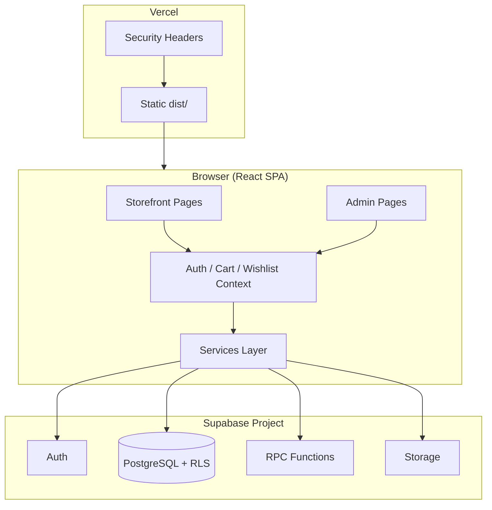
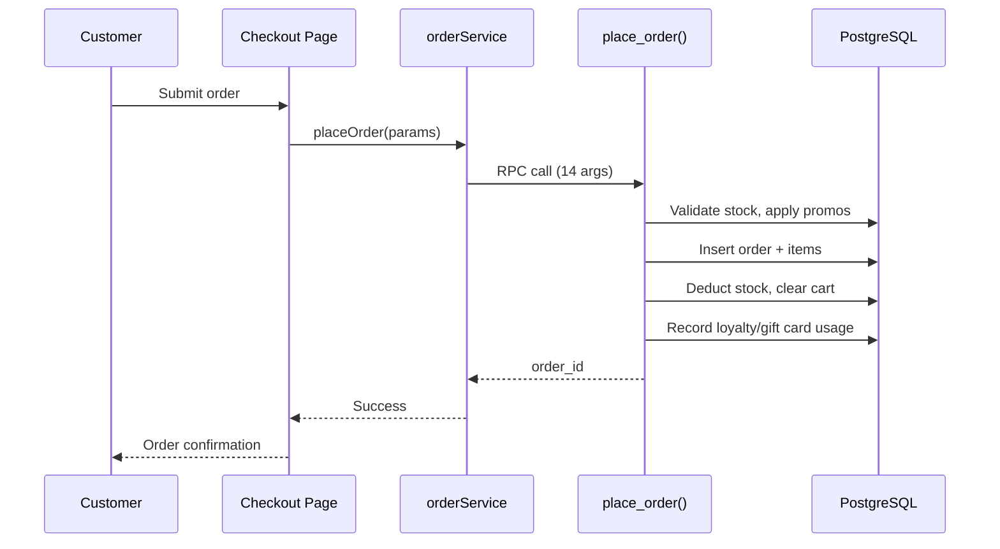

# Babees Place

## Executive Summary

Babees Place is a Kenya-oriented ecommerce web application built as a single-page React storefront and admin console, backed by Supabase (PostgreSQL, Auth, Row Level Security, and Storage). The repository targets campus and local retail scenarios: customers browse a product catalog, manage carts and wishlists, and complete checkout via cash-on-delivery or an M-Pesa payment UX; operators manage catalog, inventory, orders, promotions, loyalty, and operational health from a separate admin area within the same application.

The project addresses the engineering problem of delivering a full commerce loop—catalog, cart, authenticated checkout, order fulfillment, payments scaffolding, rewards, and notifications—without a custom backend server. Business rules for inventory deduction, pricing adjustments, promotions, and loyalty are enforced in PostgreSQL RPCs rather than only in client code, which reduces the risk of inconsistent order state when the frontend and database evolve independently.

What distinguishes this implementation from a generic storefront template is the depth of domain modeling in migrations (19 numbered SQL files, 30 public tables, 23 RPC functions), provider-based abstractions for payments and notifications (mock implementations ship by default; live providers are wired but optional), and release-candidate hardening documented in-repo (334 unit tests, zero ESLint findings, Vercel security headers, absolute SEO via `VITE_SITE_URL`). The project is at **v1.0.0-RC1** (`frontend@1.0.0-rc.1`)—feature-complete for candidate evaluation, not yet declared General Availability.

---

## The Challenge

Building Babees Place required reconciling several overlapping engineering concerns:

**E-commerce architecture.** A single React SPA serves both customer and admin experiences. Checkout must atomically validate stock, apply promotions, deduct loyalty points, record gift-card usage, create order line-item snapshots, and clear the cart—all inside the database because there is no standalone application server.

**Authentication and authorization.** Supabase Auth handles identity; `profiles.role` distinguishes customers from admins. RLS policies gate table access, and `is_admin()` supports admin-scoped policies. Route guards in the frontend prevent unauthenticated or non-admin access to protected views.

**Inventory.** Stock lives on `products.stock`. The `place_order` RPC rejects inactive products and insufficient quantity, decrements stock on success, and `cancel_order` restores stock on cancellation. Non-negative stock is enforced with a database CHECK constraint (migration 011).

**Checkout and fulfillment.** Orders support pickup and delivery modes, pickup locations, delivery address JSON, customer notes, and multiple payment methods. Order lifecycle (status, payment status, events) is managed through dedicated RPCs and admin UI.

**Promotions and loyalty.** Coupons, promotions, gift cards, loyalty accounts, referrals, and reward events are modeled in migration 018. The final `place_order` signature accepts 14 parameters including coupon code, loyalty points, gift card details, and referral code—though the checkout UI does not yet expose a referral field.

**Admin operations.** Sixteen admin pages cover dashboard KPIs, products, categories, inventory, orders, pickup locations, promotions, coupons, gift cards, loyalty, users, notifications, settings, and health monitoring.

**Schema evolution.** Early project history documented a live Supabase database that diverged from authored migrations. The current release synchronizes the remote schema through migrations 001–019 and verifies the frontend against the 14-parameter `place_order` contract.

**Performance and bundle size.** Admin analytics charts (Recharts) are lazy-loaded; Vite manual chunks split React, Supabase, charts, and icons. Product and category imagery uses lazy loading and CDN query parameters for width/quality.

**Scalability.** The architecture scales horizontally at the frontend (static SPA on Vercel) and vertically through Supabase managed Postgres. Heavy business logic in RPCs keeps the client thin but concentrates complexity in migration maintenance.

---

## Goals

Measurable engineering goals reflected in the repository and RC1 documentation:

- ✓ Secure authentication via Supabase Auth with role-based admin access
- ✓ Responsive storefront and admin console (Tailwind CSS, mobile navigation)
- ✓ Inventory management with server-side stock validation and restoration on cancel
- ✓ Admin dashboard with KPI widgets and chart visualizations
- ✓ Checkout supporting pickup and delivery with COD path verified in QA
- ✓ Payment-ready architecture (`payments`, `payment_events` tables; mock M-Pesa provider default; Daraja provider stub)
- ✓ Promotions, coupons, gift cards, and loyalty modeled in database and surfaced in UI
- ✓ In-app notification system with preferences and delivery tracking tables
- ✓ 334 passing unit/component tests with zero ESLint errors and warnings
- ✓ Production build passes; CI runs lint → test → build on push/PR
- ✓ SEO metadata, sitemap, and robots.txt driven by configurable site origin
- ✓ Accessibility baseline: skip-to-content, form labels, aria-labels on icon controls, focus-visible rings
- ✓ Database synchronized through 19 migrations with RLS on application tables

Goals explicitly **not** met at RC1 (documented as limitations):

- ✗ Live M-Pesa Daraja go-live (mock provider ships by default)
- ✗ Automated E2E gate in CI (Playwright smoke exists but is opt-in)
- ✗ Product-level sitemap URLs for every SKU
- ✗ Product reviews feature (no reviews table in migrations)
- ✗ Supabase Edge Functions in repository (`supabase/functions` absent)

---

## My Role

As lead engineer on Babees Place, responsibilities evidenced across the repository include:

| Area | Responsibilities |
|------|------------------|
| **System architecture** | SPA + Supabase BaaS design; RPC-centric checkout; provider factory pattern for payments and notifications |
| **Frontend** | 34 pages, 78 components, React Router lazy routes, storefront and admin layouts |
| **Backend / database** | Authored and reconciled migrations 001–019; RLS policies; 23 RPC functions; triggers for `updated_at` and profile bootstrap |
| **Authentication** | `AuthContext`, route guards, admin role checks aligned with `is_admin()` |
| **Deployment** | Vercel configuration (`vercel.json` SPA rewrite + security headers); GitHub Actions CI workflow |
| **Testing** | Vitest suite (334 tests), Playwright smoke spec, service and model unit tests |
| **UI / UX** | Tailwind-based responsive layouts; hero carousel; category banners; product card and gallery patterns |
| **DevOps** | CI pipeline, env validation, demo seed scripts, release documentation (CHANGELOG, release notes) |
| **SEO & accessibility** | `SeoHead`, `siteUrl` helpers, Vite SEO plugin, skip links, ARIA labels |
| **Media pipeline** | Curated product imagery map, category banner assets, `scripts/seed-demo/` tooling |

---

## Technology Stack

### Frontend
- React 18, Vite 5, React Router 6
- Tailwind CSS 3, PostCSS, Autoprefixer
- Recharts 2 (admin analytics, lazy-loaded)
- Swiper 12 (hero carousel)
- react-hot-toast, react-icons, clsx

### Backend
- Supabase (PostgREST for tables and RPCs)
- PostgreSQL 17 (per `supabase/config.toml`)
- No custom Node/Express server; no Edge Functions committed in repo

### Database
- 19 forward-only SQL migrations under `supabase/migrations/`
- PL/pgSQL RPCs for checkout, payments, notifications, loyalty, admin audit

### Authentication
- Supabase Auth (email/password)
- `profiles` table with `role` column (`user` / `admin`)
- `handle_new_user()` trigger on `auth.users` insert

### Storage
- Supabase Storage policies (migration 006) for product uploads
- Public/static assets in `frontend/public/` (hero carousel, category banners)
- Product imagery primarily via CDN URLs (Unsplash) with width/quality helpers

### Deployment
- Vercel-oriented SPA hosting (`frontend/vercel.json`)
- GitHub Actions CI (`.github/workflows/ci.yml`)
- Deploy workflow job present but commented out (manual checklist gate)

### Testing
- Vitest 3 + Testing Library + jsdom
- Playwright 1 (opt-in E2E smoke: 3 tests)
- Husky + lint-staged for pre-commit hygiene

### Developer Tools
- ESLint 8, Prettier 3
- `@/` path alias via Vite
- Demo seed CLI: `npm run seed:demo` → `scripts/seed-demo/index.mjs`

---

## System Architecture

The application follows a **browser-first, database-authoritative** pattern: the React SPA talks directly to Supabase using the public anon key; sensitive operations run inside `SECURITY DEFINER` RPCs with pinned `search_path`.

### Frontend
- Single Vite app under `frontend/` with route-level code splitting (`React.lazy`)
- Storefront layout (`StorefrontLayout`) and admin layout (`AdminLayout`) share auth state
- Services encapsulate Supabase queries and RPC calls (~48 service modules)

### Backend
- Supabase PostgREST exposes tables and RPCs
- Business logic for checkout, payments, loyalty, and notifications lives in PL/pgSQL

### Database
- 30 public tables spanning catalog, cart, orders, payments, notifications, promotions, loyalty, and operations
- RLS enabled on application tables; policies differentiate owner, authenticated, and admin access

### Authentication
- Session managed by Supabase client; `AuthContext` wraps sign-in, sign-up, sign-out, and profile loading
- Admin routes require `profiles.role === 'admin'`

### Storage
- Migration 006 defines storage bucket policies for authenticated uploads
- Admin product form supports image upload paths; demo catalog uses curated CDN URLs

### RPC layer
Key RPCs (final definitions after migration 018):

| RPC | Purpose |
|-----|---------|
| `place_order` | Atomic checkout (14 parameters) |
| `cancel_order` | Cancel order and restore stock |
| `update_order_status` | Admin fulfillment status updates |
| `update_order_payment_status` | Payment state transitions |
| `create_payment_for_order` | Initiate payment record for M-Pesa path |
| `mark_payment_initiated` / `finalize_payment` | Payment lifecycle |
| `award_loyalty_for_order` | Post-order loyalty accrual |
| `ensure_loyalty_account` / `lookup_gift_card` | Rewards helpers |
| `notify_admin_users` / `mark_notification_read` | Notification management |
| `get_bestseller_product_ids` | Recommendation input |
| `write_admin_audit` | Admin action logging |

### RLS
- Policies defined across migrations 001, 004, 006, 013–019
- Direct INSERT to `order_items` blocked; orders created only via `place_order`
- Admin read/update policies use `is_admin()` helper

### Admin
- Dashboard aggregates orders, revenue, and inventory signals via service layer
- CRUD for products, categories, pickup locations, promotions, coupons, gift cards, loyalty rules
- Order detail with status and payment updates

### Notifications
- Tables: `notifications`, `notification_preferences`, `notification_templates`, `notification_deliveries`, `notification_events`
- In-app provider implemented; email/SMS/push providers use mock or stub implementations by default

### Media
- `frontend/src/utils/images.js` — CDN URL builders with width/quality params
- `scripts/seed-demo/media-map.mjs` — curated primary/gallery/thumbnail mapping
- 12 category banner JPGs (16:9) and 6 hero carousel slides in `frontend/public/`

---

## Database Design

### Tables (30)

| Domain | Tables |
|--------|--------|
| **Core commerce** | `products`, `categories`, `cart_items`, `wishlists`, `orders`, `order_items` |
| **Profiles** | `profiles`, `customer_addresses`, `customer_preferences` |
| **Fulfillment** | `pickup_locations`, `order_events` |
| **Payments** | `payments`, `payment_events` |
| **Notifications** | `notifications`, `notification_preferences`, `notification_templates`, `notification_deliveries`, `notification_events` |
| **Promotions & loyalty** | `promotions`, `promotion_rules`, `coupons`, `coupon_redemptions`, `loyalty_accounts`, `loyalty_transactions`, `loyalty_rules`, `gift_cards`, `gift_card_transactions`, `referrals`, `reward_events` |
| **Operations** | `admin_audit_logs` |

### Relationships
- `profiles.id` → `auth.users.id`
- `orders.user_id` → `auth.users.id`; `order_items.order_id` → `orders.id`
- `cart_items` / `wishlists` link `user_id` + `product_id`
- `payments.order_id` → `orders.id`
- Loyalty, coupon, and gift-card tables reference `user_id` and/or `order_id` as applicable

### Indexes
- **52** `CREATE INDEX` statements across migrations (010 performance optimizations, slug uniqueness in 012, notification and payment lookups, etc.)
- Partial unique indexes on product and category slugs

### Policies
- RLS enabled on all application tables
- Owner-scoped SELECT/UPDATE for customer data
- Admin policies via `is_admin()` for operational tables
- Storage policies for authenticated upload paths (migration 006)

### RPCs
- **23** distinct public functions (final versions after migration chain)
- Checkout authority: `place_order` (14 parameters, `SECURITY DEFINER`, execute granted to `authenticated` only)

### Triggers
- `on_auth_user_created` → `handle_new_user()`
- `set_updated_at` on profiles, products, orders, and multiple Phase 2 tables
- `customer_addresses_single_default` → `enforce_single_default_address()`
- `payments_set_updated_at` and analogous triggers on notification/promotion tables

### Migration strategy
- Numbered forward-only files: `001_initial_schema.sql` through `019_operations.sql`
- Idempotent patterns: `IF NOT EXISTS`, `CREATE OR REPLACE`, guarded `DO` blocks
- Additive-first approach with `NOT VALID` / `VALIDATE CONSTRAINT` for online-safe CHECK additions
- Header comments document purpose, dependencies, risk, and rollback notes per file
- Remote Supabase project synchronized through 001–019 for RC1 (per release notes)

---

## Key Features

### 1. Storefront catalog and discovery

**Purpose:** Let customers browse, search, and filter products by category.

**Architecture:** `Shop.jsx` and `Home.jsx` consume product and category services; recommendations use `get_bestseller_product_ids` RPC.

**Implementation:** Product cards with lazy-loaded images, slug-based routing to `ProductDetail.jsx`, Swiper hero on homepage, 16:9 category banner cards.

**Business value:** Presents a complete browsing experience suitable for demo and QA without a separate CMS.

---

### 2. Cart and wishlist

**Purpose:** Persist shopping intent for authenticated users.

**Architecture:** `CartContext` and `WishlistContext` wrap Supabase table operations on `cart_items` and `wishlists`.

**Implementation:** Add/update/remove line items; cart feeds checkout; wishlist toggle on product cards.

**Business value:** Standard ecommerce retention patterns with server-side persistence across sessions.

---

### 3. Checkout and order placement

**Purpose:** Convert cart to order with fulfillment and payment metadata.

**Architecture:** `Checkout.jsx` → `orderService` → `place_order` RPC (14 parameters).

**Implementation:** Supports pickup vs delivery, pickup location selection, delivery address JSON, COD and M-Pesa UX paths, coupon/loyalty/gift-card application server-side.

**Business value:** Atomic server-side checkout prevents partial orders and race conditions on stock.

**Known gap:** Referral code parameter exists on RPC but is **not collected on the checkout form** (documented limitation).

---

### 4. Payments (M-Pesa scaffolding)

**Purpose:** Record and track payment attempts for non-COD orders.

**Architecture:** `payments` + `payment_events` tables; `paymentProvider.js` factory; mock M-Pesa default.

**Implementation:** `create_payment_for_order`, `mark_payment_initiated`, `finalize_payment` RPCs; `darajaMpesaProvider.js` stub for Edge Function integration.

**Business value:** Schema and client abstractions ready for live Daraja; mock provider enables end-to-end demos.

**Known gap:** COD orders do **not** create `payments` rows by design; live Daraja Edge Functions are **not committed** in repo.

---

### 5. Order management (customer and admin)

**Purpose:** Track order lifecycle from placement through fulfillment.

**Architecture:** `orders`, `order_items`, `order_events`; admin RPCs for status updates.

**Implementation:** Customer `Orders.jsx` / `OrderDetail.jsx`; admin `AdminOrders.jsx` / `AdminOrderDetail.jsx` with status and payment filters.

**Business value:** Operational visibility for both customer self-service and admin fulfillment.

---

### 6. Admin dashboard and analytics

**Purpose:** Surface KPIs and trends for operators.

**Architecture:** `AdminDashboard.jsx` with Recharts (lazy-loaded `charts` chunk ~108 KB gzip).

**Implementation:** Recent orders, low stock, activity widgets; chart presentation models in `frontend/src/models/`.

**Business value:** Single-pane view of store health without external analytics dependency at RC1.

---

### 7. Product and inventory admin

**Purpose:** CRUD for catalog and stock levels.

**Architecture:** `AdminProducts.jsx`, `AdminProductForm.jsx`, `AdminInventory.jsx`, `AdminCategories.jsx`.

**Implementation:** Slug generation, price validation, stock fields, image URL management; database enforces non-negative stock.

**Business value:** Operators can maintain catalog without SQL access.

---

### 8. Promotions, coupons, gift cards, and loyalty

**Purpose:** Discounting and retention mechanics.

**Architecture:** 11 tables in migration 018; admin pages for each entity; checkout integration via `place_order` parameters.

**Implementation:** `AdminPromotions.jsx`, `AdminCoupons.jsx`, `AdminGiftCards.jsx`, `AdminLoyalty.jsx`; customer `Rewards.jsx`.

**Business value:** Flexible promotion engine encoded in database rules rather than hard-coded frontend discounts.

---

### 9. Notifications

**Purpose:** In-app alerts for order and account events.

**Architecture:** Five notification tables; provider factory with in-app, mock email/SMS, stub push.

**Implementation:** `Notifications.jsx`, `useNotifications` hook, preference management.

**Business value:** Extensible notification pipeline; production email/SMS requires Edge Function deployment (**not in repo**).

---

### 10. Customer profile and addresses

**Purpose:** Account management and delivery address book.

**Architecture:** `customer_addresses`, `customer_preferences`; `enforce_single_default_address` trigger.

**Implementation:** `Profile.jsx`, `AddressForm.jsx`, `PersonalInfoForm.jsx`.

**Business value:** Supports delivery checkout with saved addresses.

---

### 11. Pickup locations

**Purpose:** Configure in-store or campus pickup points.

**Architecture:** `pickup_locations` table; referenced by `place_order` via `p_pickup_location_id`.

**Implementation:** `AdminPickupLocations.jsx`; checkout pickup selector.

**Business value:** Dual fulfillment model (pickup + delivery) for local retail.

---

### 12. SEO and discoverability

**Purpose:** Correct absolute URLs for crawlers and social sharing.

**Architecture:** `SeoHead.jsx`, `siteUrl.js`, `vite.seoPlugin.js`, static `sitemap.xml` and `robots.txt`.

**Implementation:** `VITE_SITE_URL` drives canonical, Open Graph, Twitter, and JSON-LD tags at build/runtime.

**Business value:** Production-ready metadata when hosting env is configured.

**Known gap:** Sitemap lists storefront entry points only—not individual product URLs.

---

### 13. Demo seed and media tooling

**Purpose:** Reproducible demo catalog for portfolio and QA.

**Architecture:** `scripts/seed-demo/` (catalog, users, promotions, media-map, apply-media).

**Implementation:** `npm run seed:demo`; curated imagery with alt text; 12 category banners and 6 hero slides.

**Business value:** Consistent demo experience without manual admin data entry.

---

### 14. Product reviews

**Status:** **Not Implemented.** No `reviews` table in migrations; `ProductDetail.jsx` contains no review submission UI backed by schema.

---

## Engineering Highlights

### Performance
- Route-level lazy loading for all pages
- Manual Vite chunks: `react` (~54 KB gzip), `supabase` (~45 KB gzip), `charts` (~108 KB gzip), `icons` (~4.5 KB gzip)
- Total JS gzip across built chunks: **~0.37 MB** (measured from `frontend/dist/assets`)
- `loading="lazy"` on product and category images
- CDN image URLs with configurable width and quality

### Security
- Anon-only Vite env vars; production build fails if Supabase env missing (`envValidation.js`)
- RLS on all application tables; direct order line-item INSERT blocked
- `SECURITY DEFINER` RPCs with `SET search_path = public`; execute revoked from `anon`
- Vercel headers: CSP, HSTS, Referrer-Policy, Permissions-Policy, X-Frame-Options, X-Content-Type-Options, COOP, CORP
- Service-role key never referenced in frontend code

### Accessibility
- Skip-to-content links on storefront and admin layouts
- Labeled login/register forms; `aria-label` on navbar search, cart, wishlist, mobile menu, and social links
- Focus-visible rings on interactive controls
- Product gallery and category images include alt text

### SEO
- Configurable `VITE_SITE_URL` for absolute metadata
- Runtime SEO head updates via `SeoHead` component
- Build-time SEO plugin for sitemap/robots origin substitution
- Static `robots.txt` and `sitemap.xml` in `frontend/public/`

### Scalability
- Stateless SPA scales on CDN; database scales via Supabase tier
- RPC-centric writes reduce round trips but concentrate logic in migration maintenance
- Provider factories allow swapping payment/notification backends without rewiring checkout

### Maintainability
- Service layer separates Supabase calls from UI components
- Model modules (`frontend/src/models/`) isolate presentation logic for charts, payments, addresses
- Numbered migrations with documented dependencies and rollback notes
- 334 automated tests guard services, utils, models, and key components

### Developer Experience
- `@/` import alias, ESLint + Prettier, Husky pre-commit hooks
- `.env.example` documents all optional provider switches
- Demo seed script for one-command catalog population
- CI validates lint, tests, and production build on every push/PR

---

## Problems Solved

### 1. Migration mismatch between live database and authored schema

**Problem:** Early audits documented a live Supabase project built manually that did not match migration `001` or frontend assumptions (column name mismatches, missing RPCs, deny-all RLS on some tables).

**Root cause:** Schema evolved on the remote project faster than the migration chain in git; empty remote migration history.

**Solution:** Authored and applied forward migrations 002–019; synchronized remote through 001–019 for RC1; verified RPC signatures against frontend service calls.

**Lessons learned:** Treat migrations as the single source of truth early; run `supabase db pull` or linked diffs before major feature work.

---

### 2. RPC signature drift (`place_order`)

**Problem:** `place_order` evolved across migrations 003, 011, 013, 016, and 018 as fulfillment, payments, and promotions were added—risk of frontend calling an outdated signature.

**Root cause:** Incremental domain expansion without a frozen contract test at each step.

**Solution:** Final 14-parameter signature in migration 018; Sprint 2 QA verified pickup and delivery COD paths against live RPC; unit tests on order validation helpers.

**Lessons learned:** Maintain an explicit RPC contract document or integration test that asserts parameter count and names on every migration touching checkout.

---

### 3. Incomplete cast in `award_loyalty_for_order`

**Problem:** Migration 018 contained an incomplete `::integer` cast that would fail at runtime.

**Root cause:** PL/pgSQL edit oversight during loyalty migration authoring.

**Solution:** Fixed in migration 018 (`fix(db): correct incomplete cast in award_loyalty_for_order`).

**Lessons learned:** Run migration SQL against a scratch database in CI where feasible; pair RPC changes with service-level tests.

---

### 4. Media pipeline and placeholder breakage

**Problem:** Product placeholders used broken relative paths; hero carousel missing slides 5–6; category sections lacked consistent banner imagery.

**Root cause:** Incremental UI work without a centralized media map or seed apply step.

**Solution:** Sprint 3 media overhaul: `media-map.mjs`, CDN galleries with alt text, 12 category banners, restored hero assets, `apply-media.mjs` for data-only refreshes.

**Lessons learned:** Separate media mapping from catalog seed data; store alt text alongside URLs in seed scripts.

---

### 5. SEO relative URL issues

**Problem:** Canonical and Open Graph URLs were relative or environment-dependent, unsuitable for production crawlers.

**Root cause:** No single site-origin helper; static sitemap/robots hard-coded or incomplete.

**Solution:** `VITE_SITE_URL`, `siteUrl.js` utilities with tests, `vite.seoPlugin.js` for build-time origin injection.

**Lessons learned:** Introduce absolute URL helpers before first production deploy; document required env in `.env.example` and CI validation.

---

### 6. ESLint and accessibility debt

**Problem:** RC hardening surfaced unused imports, missing hook dependencies, and inconsistent ARIA labeling.

**Root cause:** Rapid feature development across storefront and admin surfaces.

**Solution:** Sprint 4 cleared all ESLint warnings; added skip links, form labels, and icon button aria-labels.

**Lessons learned:** Enforce zero-warning lint in CI from mid-project onward to avoid pre-release cleanup sprints.

---

### 7. Testing and release verification

**Problem:** Need confidence for RC1 tag without inventing business metrics.

**Root cause:** Large surface area (34 pages, 23 RPCs) with opt-in E2E only.

**Solution:** 334 Vitest tests as CI gate; manual Sprint 2 checkout QA documented as PASS WITH MINOR ISSUES; Playwright smoke available via `npm run test:e2e`.

**Lessons learned:** Add at least one integration test per critical RPC path; consider Playwright smoke in CI post-GA.

---

## Testing Strategy

### Unit testing
- **Framework:** Vitest 3 with jsdom and Testing Library
- **Scope:** Services, providers, utils, models, and selected components
- **Count:** **334 tests** across **63 test files** (verified via `npm run test`)
- **Examples:** `orderValidation.test.js`, `siteUrl.test.js`, `mockMpesaProvider.test.js`, `rewardEngine.test.js`

### Integration testing
- Service modules test Supabase call shapes and error handling with mocks
- No dedicated Supabase local stack integration suite in CI

### End-to-end testing
- Playwright spec: `frontend/e2e/smoke.spec.js` (**3 tests**: home title, login form, 404 page)
- **Opt-in:** `npm run test:e2e` — **not** run in GitHub Actions CI

### Manual QA
- Sprint 2 documented full checkout walkthrough: login, browse, cart, pickup/delivery COD, admin order update
- Result: **PASS WITH MINOR ISSUES** (referral UI gap, COD payment row behavior, mock M-Pesa noted)

### Release verification
- RC1 checklist: lint 0/0, 334 tests pass, production build pass, migrations 001–019 applied, tag `v1.0.0-RC1`

### Build validation
- CI job: `npm ci` → `npm run lint` → `npm run test` → `npm run build`
- Validates `.env.example` contains required `VITE_*` keys
- Uploads `frontend/dist` artifact on main branch pushes (7-day retention)

---

## Deployment

### Vercel
- Root directory: `frontend`
- SPA rewrite: all routes → `/index.html`
- Security headers configured in `frontend/vercel.json` (CSP allows self, Supabase, Unsplash, Google Fonts)

### Supabase
- Linked project referenced in audit docs: `qfcygrxrfszcdltangec`
- Schema applied via migrations 001–019
- Auth, PostgREST, Storage, and RLS active; Edge Functions **not present in repository**

### Environment variables

| Variable | Required | Purpose |
|----------|----------|---------|
| `VITE_SUPABASE_URL` | Yes | Supabase project URL |
| `VITE_SUPABASE_ANON_KEY` | Yes | Public anon key (browser-safe) |
| `VITE_SITE_URL` | Recommended | Absolute SEO/sitemap/robots origin |
| `VITE_PAYMENT_PROVIDER` | Optional | `mock` (default) or `daraja` |
| `VITE_EMAIL_PROVIDER` / `VITE_SMS_PROVIDER` | Optional | Notification provider switches |
| `VITE_LOG_LEVEL` / `VITE_ERROR_PROVIDER` | Optional | Operations tuning |

Service-role keys and Daraja secrets are documented for Edge Functions only—never in frontend env.

### Production build
- Command: `npm run build` (from `frontend/`)
- Output: `frontend/dist/` (~18 MB including source maps; JS gzip ~0.37 MB)
- Build time: ~24–60 seconds depending on environment

### Release Candidate process
- Version: `1.0.0-rc.1` in `frontend/package.json`
- Git tag: `v1.0.0-RC1` (annotated, local per session notes)
- Documentation: `CHANGELOG.md`, `RELEASE_NOTES_v1.0.0-RC1.md`, `docs/RELEASE_SUMMARY_v1.0.0-RC1.md`
- GA (`v1.0.0`) deferred until production domain smoke and SEO verification

---

## Results

Factual, repository-verifiable outcomes at RC1:

| Result | Value |
|--------|-------|
| Unit/component tests | **334 passing** (63 files) |
| ESLint | **0 errors, 0 warnings** |
| Production build | **Passes** (~24s local) |
| Database migrations | **19** applied (001–019) |
| Public tables | **30** |
| RPC functions | **23** distinct |
| Checkout (COD) | **Operational** — pickup and delivery verified in Sprint 2 QA |
| Admin order management | **Operational** — list and status update verified |
| CI pipeline | **Lint → test → build** on push/PR to main |
| Security headers | **Configured** for Vercel |
| Release tag | **v1.0.0-RC1** prepared with release documentation |

**Not reported (no verifiable data in repository):** revenue, conversion rate, user counts, traffic, or production uptime metrics.

---

## Future Improvements

Realistic next steps documented in release notes and audits:

1. **Daraja M-Pesa go-live** — deploy Edge Functions; configure `VITE_PAYMENT_PROVIDER=daraja` and server-side secrets
2. **CI deploy job** — enable commented deploy workflow; connect Vercel/GitHub integration
3. **Playwright CI gate** — promote smoke spec from opt-in to required check
4. **Lighthouse CI** — performance and accessibility budgets on key routes
5. **Product-level sitemap** — generate per-SKU URLs for SEO
6. **Own-hosted media** — Supabase Storage or Cloudinary ownership instead of demo CDN URLs
7. **Product reviews** — schema, RLS, and UI (currently absent)
8. **Referral code on checkout** — expose `p_referral_code` in checkout form
9. **Push notifications** — replace `stubPushProvider` with Web Push implementation
10. **Edge Functions** — commit `supabase/functions` for email, SMS, and M-Pesa
11. **GA release (`v1.0.0`)** — after production domain cutover and live URL smoke
12. **Brand consistency** — align npm package name (`babis-place-frontend`) with product name (Babees Place)

---

## Technical Statistics

Counts computed from the repository on **2026-08-04** (RC1):

| Metric | Count | Source |
|--------|------:|--------|
| React components (`.jsx`, non-test) | **78** | `frontend/src/components/` |
| Pages | **34** | 18 storefront + 16 admin |
| Custom hooks | **3** | `useDebounce`, `usePagination`, `useNotifications` |
| Service modules (non-test) | **48** | `frontend/src/services/` |
| Utility modules (non-test) | **9** | `frontend/src/utils/` |
| Context providers | **3** | Auth, Cart, Wishlist |
| Model modules (non-test) | **10** | `frontend/src/models/` |
| Provider implementations | **13** | `frontend/src/services/providers/` |
| Database tables (public) | **30** | `CREATE TABLE` in migrations |
| RPC functions (distinct) | **23** | Final definitions in migrations |
| SQL migrations | **19** | `supabase/migrations/001`–`019` |
| Database indexes | **52** | `CREATE INDEX` in migrations |
| RLS policy statements | **115** | `CREATE POLICY` / `ENABLE ROW LEVEL SECURITY` |
| Triggers | **18** | `CREATE TRIGGER` in migrations |
| Unit/component tests | **334** | Vitest (`npm run test`) |
| Test files | **63** | `*.test.js` / `*.test.jsx` |
| E2E tests (Playwright) | **3** | `frontend/e2e/smoke.spec.js` |
| Production `dist/` size | **~18 MB** | Includes source maps |
| Total JS (gzip, all chunks) | **~0.37 MB** | Measured from built assets |
| Category banner assets | **12** | `frontend/public/category_banners/` |
| Hero carousel slides | **6** | `frontend/public/hero_carousel/` |
| npm version | **1.0.0-rc.1** | `frontend/package.json` |

---

## Image Recommendations

Screenshots for portfolio and DevHub presentation (capture from running app or production deploy):

| Section | Recommended screenshot |
|---------|---------------------|
| Executive Summary | Homepage hero with category banners and featured products |
| The Challenge / Architecture | Hand-drawn or exported architecture diagram (Mermaid render) |
| Storefront catalog | Shop page with filters and product grid |
| Product detail | Gallery, price, add-to-cart, wishlist |
| Cart | Cart line items with quantity controls |
| Checkout | Pickup vs delivery selector, payment method, order summary |
| Order confirmation | Post-checkout confirmation page |
| Customer orders | Orders list and order detail |
| Rewards | Loyalty balance and rewards page |
| Admin dashboard | KPI cards and charts (`AdminDashboard`) |
| Admin products | Product list and product form |
| Admin orders | Order list with status filters |
| Admin inventory | Low-stock or inventory view |
| Admin promotions | Coupons or promotions management |
| Notifications | In-app notifications page |
| Database design | ERD exported from Supabase or dbdiagram of 30 tables |
| System architecture | Mermaid diagrams from this document |
| Mobile | Navbar mobile menu and responsive product card |
| SEO | Browser devtools showing canonical/OG tags with absolute URL |
| CI / quality | GitHub Actions green run showing lint, test, build |

---

## Portfolio Summary

**Problem.** Babees Place needed a full ecommerce loop—catalog, cart, authenticated checkout, order fulfillment, payments scaffolding, promotions, loyalty, and admin operations—without maintaining a custom backend server, while keeping business rules trustworthy under concurrent users.

**Solution.** A React 18 + Vite single-page application deployed to Vercel talks directly to Supabase for Auth, Postgres, RLS, and Storage. Checkout and inventory changes run inside PostgreSQL RPCs (`place_order` with 14 parameters), so stock deduction, promotion application, and order creation happen atomically. Provider factories abstract payments (mock M-Pesa default) and notifications (in-app plus mock email/SMS), allowing live integrations later without rewriting checkout.

**Architecture.** 34 pages and 78 components share three context providers (auth, cart, wishlist) and a 48-module service layer. The database defines 30 tables, 23 RPC functions, and 19 forward-only migrations. Admin and storefront coexist in one SPA with route guards and `is_admin()`-backed RLS policies.

**Results.** At v1.0.0-RC1 the repository delivers **334 passing tests**, **zero ESLint findings**, a **passing production build**, synchronized migrations **001–019**, and **verified COD checkout** for pickup and delivery. Security headers, accessibility baseline, and configurable absolute SEO are in place. Live M-Pesa, Edge Functions, product reviews, and E2E CI gating remain documented future work—not claimed as shipped.

**Technology.** React, Vite, Tailwind CSS, React Router, Recharts, Swiper, Supabase (PostgreSQL 17, Auth, RLS, Storage), Vitest, Playwright, ESLint, Prettier, GitHub Actions, Vercel.

---

*Document generated from repository inspection. All statistics verifiable via source tree and npm scripts. No business performance metrics are claimed.*
